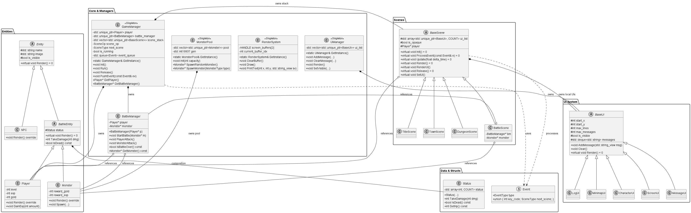

# 🛡️ C++ Text MUD Game Framework

본 프로젝트는 C++17 이상을 기반으로 작성된 **콘솔 텍스트 기반 MUD 게임 전용 프레임워크**입니다.

 

## 🗂️ 클래스 구조 (Architecture)

### **Core & Management**
* **`GameManager`**: 고정 스텝(Fixed-Step) 메인 루프 실행, 지연된 이벤트 큐 처리 및 **상태 스택(Scene Stack)** 기반의 씬 전환을 담당합니다. 또한 `Player`와 `BattleManager`의 생명주기를 소유(Own)하는 최상위 관리자입니다.
* **`RenderSystem`**: Windows API를 활용한 **더블 버퍼링(Double Buffering)** 기법을 적용하여 콘솔 화면의 깜빡임(Flickering)을 제거하고 텍스트 출력을 전담합니다.
* **`UIManager`**: 게임 전역에서 사용되는 공통 UI(로그 창, 시스템 메세지 등)의 가시성(Visibility)과 렌더링을 일괄 관리합니다.
* **`MonsterPool`**: **오브젝트 풀링(Object Pooling)** 방식을 적용하여, 메모리 할당/해제(`new/delete`)의 오버헤드 없이 무작위 또는 특정 타입의 몬스터를 효율적으로 생성(재사용)하고 관리하는 싱글톤 객체입니다.
* **`BattleManager`**: 플레이어와 몬스터 간의 턴제 전투 로직, 데미지 계산 및 승패 상태를 판정하는 전투 전담 관리자입니다.

### **Entity**
* **`Entity` / `NPC`**: 이름과 이미지, 가시성(`is_visible`) 속성을 가진 모든 게임 내 객체의 최상위 추상 클래스 및 비전투형 구현체입니다.
* **`BattleEntity` / `Player`, `Monster`**: 전투 기능을 가진 클래스이며, **`Status`** 클래스로 능력치를 관리합니다.
* **`Status`**: HP, MP, 공격력, 방어력 등 모든 스탯 데이터를 처리합니다.

### **Scene & UI System**
* **`BaseScene` / `TitleScene`, `TownScene`, `DungeonScene`, `BattleScene`**: 게임의 각 상태(화면)를 정의합니다. 씬을 각각의 레이어로 보고 처리하며 불투명도(`IsOpaque`) 속성을 통해 하위 씬을 덮어 그리는 방식의 화면 출력을 지원합니다.
* **`BaseUI` / `ScreenUI`, `LogUI`, `MinimapUI` 등**: 씬 내부의 특정 좌표에 테두리와 텍스트 메시지 큐(Deque)를 출력하는 개별 UI 컴포넌트들입니다.

 

## 🚀 향후 업데이트 계획 (To-Do)
- **던전 탐색 기능**: 랜덤 생성 던전을 탐색하도록 구현
- **전투 시스템**: D&D 식 다이스로 데미지 판정(데미지에 랜덤성 부여), 다대다 전투, 전투 행동 선택
- **인벤토리**: 캐릭터의 아이템 소지 및 장착 시스템 구현
- **상점**: 상인 NPC 추가 및 물건 구매/판매 기능 구현
- **파일 입출력**: 플레이어 세이브 데이터 및 몬스터 정보의 파일 처리
- **사운드 시스템**: 게임 몰입도를 높이기 위한 배경음 및 효과음 추가
- **타격감**: 텍스트 및 UI 연출을 활용한 게임 내 타격감 추가

 

## 📚 학습 기록 및 트러블슈팅 (Study & Log)

프레임워크를 구현하며 발생한 문제, 해결 방식, 그리고 C++ 개념들을 기록합니다.

* 📝 [마이어스 싱글톤, 고정 스텝 게임루프, 게으른 씬 전환 정리](./Study/file1.md)
* 📝 [플리커링 해결, 씬 상태 스택, Entity 시스템](./Study/file2.md)
* 📝 [씬 겹쳐 그리기, 턴제 기반 전투시스템, 오브젝트 풀링](./Study/file3.md)